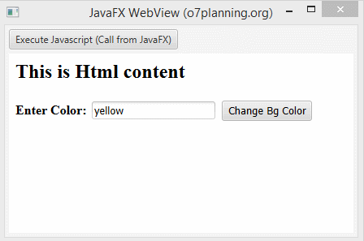

# Final Project

**Title:** Items Application Manager<br>
**Name:** Patrick Murphy<br>
**Student ID:** G00123456<br>

## Application Function
Discuss, in detail, what the application does. Add a screenshot image of the application in use (See example of image added below).

## Running the Application
Provide step by step instructions on how to run your applicaiton. Are there any prerequisite softwares required?

```
List the instructions step by step
    1. Clone this repository to your desktop.
    2. Open it with Eclipse
            :
            :
```
## Minimum Project Requirments

Confirm and demonstrate how you have met all minimum project requirments:

* The code must compile.
* The application code must be formatted in a consistent and standard way.
* The code must contain comments. One line per Class, method and variable at minimum.
* There must be one commit per week.
* The documentation and commentary must be free typographical and grammatical errors.

## Project Requirments above and beyond

Discuss any application features or design elements that show you went above and beyone basic requirments.

## Application Architecture
Discuss in detail how the application is structured. List all Classes. List their method and what they do. Discuss what structures are used to store data objects.

Add a screenshot of the application architecture.

## JavaFX
Discuss the GUI design used. Discuss why you chose this design and any features you thing make your application stands out.



## Roadblocks
Discuss the issues you faced with creating your application. Provide possible solutions to these issues. What would you have done differently if you had to do this again?

## Resources
Provide links to resources used:

* [Tutorialspoint](https://www.tutorialspoint.com/java/) - Java Tutorials site I found helpful
